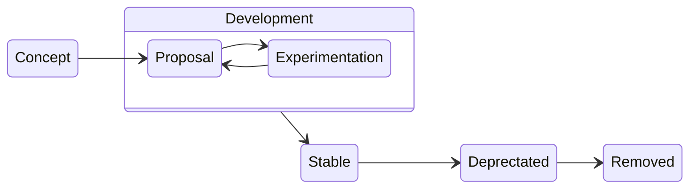

# JSON Schema Specification Development and Publication Process

## Purpose

This document describes the development and publication process for the JSON Schema specifications contained within this repository.

- [JSON Schema Core](./jsonschema-core.md)
- [JSON Schema Validation](./jsonschema-validation.md)

## Definitions

### Defined Behavior

Some behaviors within JSON Schema may be explicitly or implicitly undefined by the specifications for various reasons.  How to handle these behaviors is generally left to implementations.

A defined behavior is one that is fully and unambiguously defined by the specifications.

An undefined behavior is said to have an "indeterminate" validation result since implementations may resolve the behavior in different ways.

### Stability and Breaking Changes

Stability is defined using the level of compatibility between sequential releases.  If all schemas which are written to one release produce the same defined behavior under the following release, then those releases are compatible, and the specification is said to be stable between them.

If an existing schema under the new release exhibits defined behavior that is contrary to defined behavior under the previous release, the new release is said to contain breaking changes and the specification is unstable between those releases.

If a new release fully defines a previously undefined (or under-defined) behavior, the new release is still considered compatible, even if it contradicts the decision of any particular implementation.

For reference, this table shows the validation results of a hypothetical schema and instance across two consecutive releases to illustrate the compatibility of those releases:

| _Next_ ➡️<br>⬇️ _Current_ | pass | fail | indeterminate |
|:---:|:---:|:---:|:---:|
| **pass** | ✅ | ❌ | ❌ |
| **fail** | ❌ | ✅ | ❌ |
| **indeterminate** | ✅ | ✅ | ✅ |

### Release

A release is any single publication of the JSON Schema specifications (as a group).

### Version

Consecutive releases which maintain compatibility with each other comprise a version.

## Release and Version

The JSON Schema specification will aim to publish annually on or about the First of January each year.  Releases are identified by the year they are published.

When a new release contains breaking changes, that release begins a new version of JSON Schema.

The version will be identified as an integer, starting with `1` and incrementing as needed.

Stability will be prioritized when making changes to the specification.  Breaking changes are undesired and should be avoided when possible.

## Publication

### Specifications

The specifications will be published on the JSON Schema website, https://json-schema.org/, using a path comprised of the version, year, and document name.  For example,

```
https://json-schema.org/1/2025/core.html
https://json-schema.org/1/2025/validation.html
```

Once a specification document has been published, neither the document (save for minor errata such as spelling mistakes) nor its publication URL may change.  If the TSC elects to alter the above URL scheme, the new scheme only applies to future publications and are not retroactive.

### Meta-schemas

A release meta-schema will be published under the same path using `schema.json` as the file name.

```
https://json-schema.org/1/2025/schema.json
```

The website will also be configured to:

- serve the meta-schema from its release folder
  ```
  https://json-schema.org/1/2025/
  ```
- serve the meta-schema for the latest release in a version from its version folder
  ```
  https://json-schema.org/1/
  ```

The latest-release meta-schemas will be updated with proposals as indicated by the [Proposal section](#proposal) of this document.

```diff
@@ These are only publication and availability URLs.  The specification will define the `$id` values for the meta-schemas. @@
```

## Feature Life Cycle

New features will progress through a sequence of stages before being added to the specification, and existing stable features must be formally deprecated before being removed. The stages of the life cycle, in order, are:

- Concept
- Proposal
- Experimentation
- Stable
- Deprecated
- Removed

The flow through these stages is depicted below:



### Concept

The feature life cycle begins with an idea expressed in a GitHub issue in this repository.  Initial discussion may occur in Slack or another space, but the life cycle does not formally begin until a GitHub issue is created.

The discussion should cover how the feature could work, use cases, syntax, alternatives, whether it’s a breaking change, etc., with a goal of deciding rough requirements.

During this stage, members of the Core Team will implement private prototypes of the ideas expressed in the issue to get a feel for how it integrates with the stable features.  Questions to address may include:

- Does the idea operate within the confines of existing JSON Schema evaluation processes, or does it define something new?
- Is the idea merely a shortcut for some existing functionality (syntactic sugar), or does it solve a previously unsolvable problem?
- What is the expected complexity for implementing the feature?

At least two (2) Core Team members must have implemented prototypes before the concept can continue to the formal proposal process.

### Proposal

Once a rough consensus for the idea has been reached, a formal proposal will be written, separate from the specification, with the goal of precisely defining specification changes.

The proposal will use the [Proposal Template](./proposals/proposal-template.md) and be stored in this repository's `proposals` folder.

Additionally, a draft ADR will be included using the file name of the proposal document with an `-adr` suffix: `{proposal-file-name}-adr.md`.  This ADR will include additional information from the "Concept" discussion.

Proposed keywords will be added to the appropriate vocabulary meta-schemas in:

- latest published release and
- the `main` branch of this repository.

The subschema for the proposed keyword will contain only a `$comment` keyword indicating that the feature is experimental and containing a link to the proposal document.  Aside from the `$comment` keyword, the subschema will be empty.

_This is done so that a proposed keyword is allowed but not validated as its syntax may change during the proposal/experimentation process.  It also permits different implementations to support different variations of each proposal separately throughout this process. It will be up to the implementation to validate these keywords in accordance with their support._

Tests for the proposal are added to the JSON Schema Test Suite.

```diff
@@ TODO: Identify a location within the test suite for proposals. @@
```

Once an initial draft of the proposal has been completed and published, the feature moves into Experimentation.

### Experimentation

Implementations may begin to support the new feature.

Feedback from implementers and users are expected to result in refinements to the proposal, which will then be updated in the implementations.

Breaking changes to a proposed feature MAY occur, but are highly discouraged.

In order to proceed to the next stage ([Stable](#stable)):

- at least five (5) implementations support the feature
- there is sufficient evidence of use
- no changes are requested for a period of six (6) weeks

```diff
@@ TODO: Determine usage metrics. @@
```

Experimental features are not considered to be interoperable across implementations.

If a proposal cannot advance to the next stage, it may be removed.  The proposal document is moved to an `archive` subfolder, the keyword is removed from the meta-schemas, and any tests are moved to an `archive` subfolder. The removal of a feature which has not reached the stable state is not considered a breaking change.

### Stable

The feature is incorporated into the specification in the `main` branch as specified by the proposal document, and the feature will be required as of the next release.

The draft ADR is completed, dated, and moved to the `adr` folder.

The appropriate vocabulary meta-schema in the `main` branch is updated to include a subschema that validates the feature's syntax requirements.  This will be made available with the next release.

Upon publication of the new release, the meta-schema for the lapsed release will have the keyword removed.

The appropriate tests are incorporated into the main suite.

### Deprecated

If a feature is no longer useful, e.g. it has been replaced, it may be deprecated by indicating it as such in the specification.

Implementations must support deprecated features.

### Removed

A feature must have been published as deprecated for at least one release before it can be considered for removal.

Feature removal is considered a breaking change.
